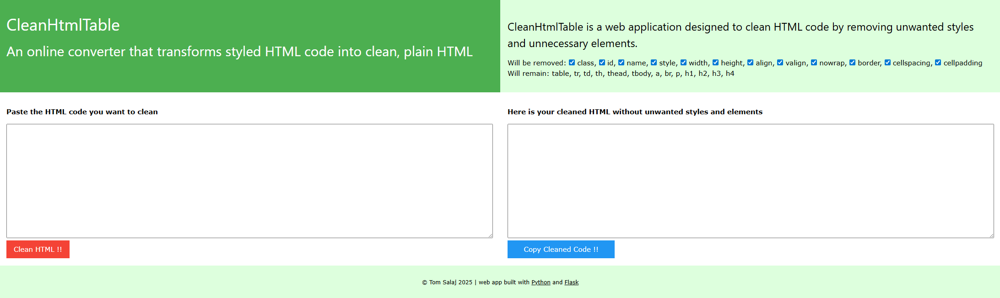

# 🧼 CleanHtmlTable
by Tom Salaj

[](https://www.python.org/)
[
[](https://github.com/tom591/CleanHtmlTable?tab=MIT-1-ov-file)
[](https://vycistihtml.cz)

---
## 🧰 What is it?
📝 The live demo is available in **Czech** at the link above.

**CleanHtmlTable** is a Flask-based web application designed to clean HTML code by removing unwanted styles and unnecessary elements.

---

## ⚡ Quick Demo of Simplicity

This project is a minimal demonstration of what Flask can do — the core logic fits in just **40 lines of Python**  
(and could be even shorter 😄).

---

## 🛠️ About the App

A small and simple **Flask (Python)** web app built to sanitize styled HTML tables.  
It strips away unwanted attributes and inline styles — some of which can be re-enabled via checkboxes.

---

## 📦 Dependencies

Only **three modules** are needed:

- `Flask` – web framework  
- `beautifulsoup4` – HTML parsing and cleaning  
- `Flask-WTF` – used only for basic CSRF protection ([Flask-WTF docs](https://flask-wtf.readthedocs.io))

---

## 🎨 Frontend

The template uses CSS styles imported from **[w3schools.com](https://www.w3schools.com/w3css/)** —  
meaning it’ll survive even the end of the world 😄  
Inline styles ensure basic mobile responsiveness.

---

## 📸 Screenshots

### 🖥️ Fullscreen view


### 📱 Responsive view (mobile/tablet)


---

## ▶️ Getting Started

To run locally:

1. Download or clone the repository  
2. Install dependencies using pip:  
   ```bash
   pip install -r requirements.txt
   ```
3. In the app folder, start the server:  
   ```bash
   flask run
   ```
4. Done! Nothing more, nothing less.

---

## 📝 License

This project is released under the [MIT License](LICENSE).  
Use freely, modify as needed. No warranty provided.

---

## 🚀 Final Words

**Learn, code, enjoy — good luck!**  
*Tom Salaj*

[](https://www.buymeacoffee.com/tomsalaj)
